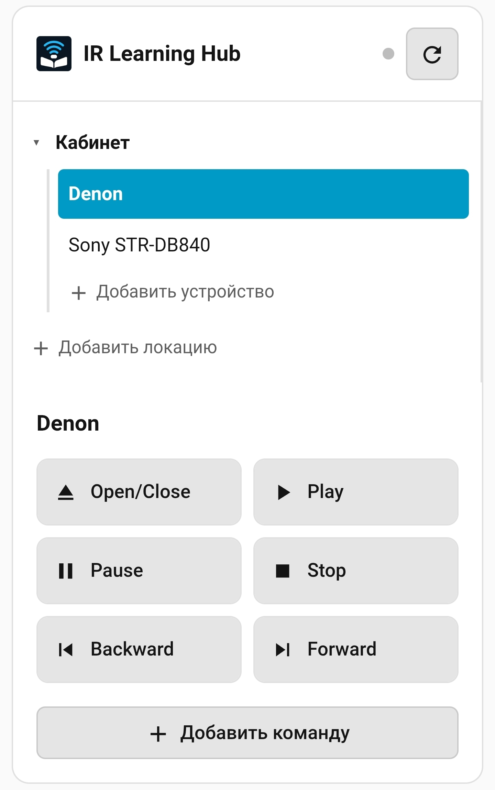

# IR Learning Hub

IR Learning Hub is a local Home Assistant custom integration for learning, generating, storing, testing, organizing, exporting, importing, and replaying infrared commands through a ZHA-connected Tuya TS1201 / MOES UFO-R11 IR blaster.

It turns the TS1201 from a low-level ZHA device into a usable remote-control hub: learn a button from a physical remote, test it, save it under a stable command ID, replay it from Home Assistant services or native `remote` entities, and manage the command library from a Lovelace card.

The integration is intentionally local-first. It uses Home Assistant's native ZHA runtime and does not require Tuya Cloud, Smart Life, Zigbee2MQTT, SmartIR, IR Wrapper, scripts, or helper entities for the main command path.

## What It Does

- Discovers supported ZHA IR transmitters during setup, with manual setup as a fallback.
- Starts TS1201 learning mode and reads the learned IR code from ZHA.
- Sends raw learned codes for testing before saving.
- Generates Sony SIRC commands, including a tested Sony STR-DB840 profile workflow, without requiring the original remote for every button.
- Stores verified commands in Home Assistant storage.
- Organizes commands as `Location -> IR device -> Command`.
- Exposes a stable Home Assistant service API for automations, scripts, and Developer Tools.
- Exposes each configured TS1201 as a native Home Assistant `infrared` emitter entity.
- Exposes registry IR devices as native Home Assistant `remote`, `media_player`, and `switch` entities that send through the emitter — directly usable by Assist, voice, and the LLM API.
- Infers `media_player`/`switch` capabilities from an explicit per-command `feature` role, so any command naming works.
- Supports multiple transmitters via the canonical hub + config-subentries model.
- Provides a bundled Lovelace card for day-to-day use.
- Supports command rename, relearn, delete, and optional `mdi:*` icons without replacing the stored IR code.
- Exports and imports one device profile as JSON, so a command set can be moved to another logical remote without relearning.
- Provides localized setup, services, sensor states, errors, and card UI in English, Russian, and Ukrainian.

## Current State

IR Learning Hub `v0.3.0` is a functional Home Assistant custom integration for the confirmed TS1201 / MOES UFO-R11 ZHA path.

Release metadata:

```json
{ "version": "0.3.0" }
```

Current release tag: `v0.3.0`.

The implemented flow covers the full command lifecycle:

1. Set up the hub and its first transmitter in the config flow (add more transmitters later as config subentries).
2. Create locations and IR devices.
3. Learn a command from a physical remote.
4. Test the captured IR code.
5. Save it with a stable ID and display name.
6. Replay it from the Lovelace card, Home Assistant services, automations, scripts, or the generated `remote` entity.
7. Maintain the library with rename, relearn, icon, delete, export, and import actions.

Saved commands survive Home Assistant restarts because they are stored through Home Assistant's `Store` API. The TS1201's last-learned-code attribute is volatile, so `read_last_code` can return `code_empty` after a restart until a new button is learned. This does not affect already saved commands.

The integration currently targets one confirmed hardware/profile combination. The architecture keeps the transport layer isolated so additional ZHA IR transmitter profiles can be added later without changing the registry, UI model, or entity projection.

`remote`, `media_player`, and `switch` consumer entities are all shipped. The
domain is chosen per device from its `preferred_domain` and the capabilities
inferred from each command's `feature` role.

## Supported Hardware

The confirmed profile is:

| Field | Value |
| --- | --- |
| Device | Tuya TS1201 / MOES UFO-R11 |
| Manufacturer | `_TZ3290_ot6ewjvmejq5ekhl` |
| Quirk | `zhaquirks.tuya.ts1201.ZosungIRBlaster` |
| Endpoint | `1` |
| IR control cluster | `0xE004` / `57348` |
| Learn command | `1` |
| Send command | `2` |
| Learned-code attribute | `0` |

Cluster `0xED00` / `60672` may also appear on the device, but the integration uses cluster `0xE004` because learn and send are confirmed there for the supported profile.

## Lovelace Card

The bundled card is the intended daily interface.

It provides:

- a tree of locations and IR devices;
- inline add forms with name-first entry and automatic ID generation;
- remote-style command buttons;
- one-click sending;
- command relearn from the command menu;
- a three-step learning wizard;
- command icon selection with `mdi:*` support;
- inline rename actions;
- delete confirmations;
- device-profile export/import;
- a compact status indicator with tooltip for idle, learning, sending, code received, and error states.



Example card configuration:

```yaml
type: custom:ir-learning-hub-card
title: IR Learning Hub
status_entity: sensor.ir_learning_hub_status
timeout: 60
poll_interval: 2
```

The card uses only `ir_learning_hub.*` services. It does not talk to ZHA directly.

## Service API

IR Learning Hub exposes services under the `ir_learning_hub` domain:

- `learn`
- `read_last_code`
- `learn_and_read`
- `test_code`
- `generate_code`
- `save_command`
- `send_command`
- `list_commands`
- `add_location`
- `add_device`
- `update_device`
- `add_command`
- `update_command`
- `rename_location`
- `rename_device`
- `rename_command`
- `delete_location`
- `delete_device`
- `delete_command`

The Lovelace card is built on top of the same services that automations and scripts can use.

## Native Entities

IR Learning Hub creates Home Assistant entities:

- one `infrared` emitter entity per transmitter (config subentry);
- one consumer entity per registry IR device — `remote`, `media_player`, or `switch`, chosen from the device's `preferred_domain` and capabilities.

The send path is:

```text
remote / media_player / switch -> Home Assistant infrared helper -> IR Learning Hub emitter -> ZHA TS1201 transport
```

Consumer entities do not call ZHA directly. They resolve the stored code, wrap it as a `zosung_base64` payload, and send through the emitter entity.

- `remote`: `remote.send_command` expects stored `command_id` values (raw passthrough), not display labels; plus `remote.turn_on/off/toggle`.
- `media_player`: standard `media_player.*` services; features and `source_list` are built from each command's `feature` role (`media_player.select_source` takes the source label).
- `switch`: on/off for pure power devices.

Capabilities come from an explicit per-command **`feature`** role (e.g. `play`, `volume_up`, `source`, `power_toggle`), set when saving a command or via `ir_learning_hub.update_command` / the Lovelace card. The free-text `command_id` is never interpreted, so any naming works. See [docs/SERVICES.md](docs/SERVICES.md) for the role vocabulary.

Power state is assumed because IR has no feedback channel. A device with only `power_toggle` can become out of sync if it is changed outside Home Assistant.

### Assist and Voice Exposure

The entities are registered normally and can be exposed to Assist, voice assistants, and the LLM API. Exposure is controlled by Home Assistant:

```text
Settings -> Voice assistants -> Expose
```

Enable exposure for the new `remote` entities, or enable Home Assistant's "expose new entities automatically" option for the assistant you use. The integration does not force exposure.

Example saved-command replay:

```yaml
service: ir_learning_hub.send_command
data:
  location_id: cabinet
  ir_device_id: cd_player
  command_id: open_close
```

For complete schemas, response data, and error codes, see [docs/SERVICES.md](docs/SERVICES.md).

## Installation

See [docs/INSTALLATION.md](docs/INSTALLATION.md) for detailed installation, update, and HACS notes.

### HACS

Add this repository as a HACS custom repository with category `Integration`:

```text
https://github.com/slawa19/IR-Learning-Hub
```

Install release `v0.3.0` or newer, then restart Home Assistant.

### Lovelace Resource

Add the bundled card as a Lovelace resource:

```yaml
url: /ir_learning_hub/ir-learning-hub-card.js
type: module
```

After updating the integration, restart Home Assistant. The card script is served without long-lived cache headers, so the browser should pick up the new version without changing the resource URL.

When updating a live system to `0.3.0`, a one-time migration reshapes the old
one-entry-per-transmitter setup into a single hub entry with transmitter
subentries. Learned commands are preserved (the registry store is untouched; the
migration only changes config-entry shape). Verify after restart that:

1. the integration shows one "IR Learning Hub" entry with a transmitter subentry;
2. the existing `sensor.ir_learning_hub_status` still exists;
3. each transmitter has an `infrared` emitter entity;
4. each registry IR device has its consumer entity (`remote`/`media_player`/`switch`);
5. existing `ir_learning_hub.*` services still send saved commands.

## Basic Usage

Recommended card flow:

1. Add a location.
2. Add an IR device inside that location.
3. Add a command. Enter the display name first; the card generates the ID automatically.
4. Start learning.
5. Point the physical remote at the TS1201 and press the desired button.
6. Test the learned code or skip testing.
7. Save the command.
8. Send it from the command grid.

Service-only flow:

1. Call `ir_learning_hub.learn_and_read` with response data enabled.
2. Point the physical IR remote at the TS1201 and press the desired button.
3. Use the returned `code` with `ir_learning_hub.test_code`.
4. If the target device responds, save it with `ir_learning_hub.save_command` and `verified: true`.
5. Replay the saved command with `ir_learning_hub.send_command`.

Native entity flow:

1. Create or import a registry IR device and commands; set each command's `feature` role (in the card or via `update_command`).
2. The consumer entity (`remote`/`media_player`/`switch`) materializes immediately on the registry update signal — no restart needed.
3. Control it with the standard domain services (`media_player.*`, `remote.send_command`, `switch.*`).
4. Optionally expose the entity to Assist in Home Assistant voice settings.

Example `save_command` data:

```yaml
location_id: cabinet
ir_device_id: cd_player
command_id: open_close
name: Open/Close
code: "<base64-code>"
verified: true
```

IDs must match `[a-z0-9_]+`. Display names can be normal human-readable text.

## Generated Sony Commands

IR Learning Hub can generate Sony SIRC commands and convert them into the same `zosung_base64` payload that the TS1201 sends. This was validated on a Sony STR-DB840 receiver with the `Power` command.

Example service call:

```yaml
service: ir_learning_hub.generate_code
data:
  protocol: sony_sirc
  command: 21
  device: 16
  bits: "12"
  repeats: 3
```

Use the returned `code` with `ir_learning_hub.test_code`, then save it with `save_command` if the device responds.

The repository also includes a small local utility that generates a card-importable Sony STR-DB840 profile:

```text
python tools/generate_sony_str_db840_profile.py --output sony_str_db840.json
```

Import the generated JSON from the device menu in the Lovelace card. Use `--verified` only after you have confirmed the generated commands work with your receiver.

## Command Library

The registry is structured like this:

```text
transmitter
  location
    IR device
      command
```

Command records store the learned or generated code, display name, format, verification flag, update timestamp, optional display icon, and optional source/provenance data. Relearning a command replaces the IR code but preserves its icon.

The device profile export/import feature exports one IR device's commands as JSON. Import writes those commands into the device selected from the menu and uses the same backend services as the card.

## Home Assistant Integration Details

- Storage: Home Assistant `Store`.
- Main transport: Home Assistant ZHA.
- Frontend: bundled Lovelace custom card served by the integration.
- Status: translated diagnostic sensor.
- Localization: `strings.json` and `translations/*.json` for backend surfaces, plus a card-side translation table.
- HACS: release/tag based installation with repository icon assets under `brand/`.

## Why Native ZHA

The TS1201 exposes useful IR functionality through vendor-specific ZHA behavior rather than a polished Home Assistant entity model. IR Learning Hub keeps the transport local and uses the ZHA path already available in Home Assistant:

- learn and send are handled by the confirmed Zosung control cluster;
- the learned code is read from the backend ZHA device object;
- saved commands live in Home Assistant storage instead of volatile device attributes;
- services make the workflow available to the UI, automations, scripts, and agents.

## Non-Goals

The current architecture intentionally does not use:

- Tuya Cloud or Smart Life as the runtime;
- Zigbee2MQTT transport;
- SmartIR as the sender;
- Home Assistant helper entities as primary storage;
- Home Assistant core patches or ZHA monkey patching;
- a public IR code database.

SmartIR-compatible export and additional transmitter transports may be considered later, but they are not required for the current ZHA command workflow.

## Repository Layout

```text
	custom_components/ir_learning_hub/
	__init__.py              # integration setup, services, frontend paths
	brand/                   # integration brand assets
	capabilities.py          # pure capability inference from command feature roles
	config_flow.py           # hub config flow + transmitter subentry flow
	const.py                 # constants and service names
	consumer.py              # shared consumer-entity base, manager, send helpers
	device_profiles.py       # supported transmitter profile definitions
	errors.py                # localized integration error type
	icon.png                 # local Home Assistant integration icon
	infrared.py              # infrared emitter entity platform (per subentry)
	ir_command.py            # opaque Zosung command wrapper
	media_player.py          # registry-backed media_player consumer entities
	registry_runtime.py      # pure registry-to-entity projection helpers
	remote.py                # registry-backed remote consumer entities
	sensor.py                # diagnostic status sensor platform
	services.yaml            # service field structure for Home Assistant
	status.py                # in-memory status model
	storage.py               # Store-backed command registry
	storage_migration.py     # pure storage migrations (v1..v4)
	switch.py                # registry-backed switch consumer entities
	strings.json             # English source strings for HA translations
	transmitter_identity.py  # canonical transmitter id normalization
	translations/            # backend translations
	ir_formats/              # pure IR format/protocol conversion helpers
	zha_adapter.py           # ZHA learn/read/send adapter
	www/ir-learning-hub-card.js

brand/                      # HACS repository icon assets
hacs.json
tools/
	generate_sony_str_db840_profile.py

docs/
	ARCHITECTURE.md
	INSTALLATION.md
	SERVICES.md
	TROUBLESHOOTING.md
	ROADMAP.md
	ТЗ Native ZHA IR Learning Hub.md
```

## Documentation

- [Installation](docs/INSTALLATION.md)
- [Services](docs/SERVICES.md)
- [Architecture](docs/ARCHITECTURE.md)
- [Troubleshooting](docs/TROUBLESHOOTING.md)
- [Roadmap](docs/ROADMAP.md)
- [Contributing](CONTRIBUTING.md)
- [Security](SECURITY.md)
- [Changelog](CHANGELOG.md)
- [Current Russian technical specification](docs/ТЗ%20Native%20ZHA%20IR%20Learning%20Hub.md)

## Development Notes

The integration keeps ZHA transport logic in `zha_adapter.py`, registry logic in `storage.py`, setup logic in `config_flow.py`, and user workflow logic in the Lovelace card. The UI should call integration services and should not reimplement ZHA reads or Zigbee cluster traversal.

When publishing a release, keep `manifest.json`, the Lovelace card version, README examples, installation docs, changelog, the git tag, and the GitHub Release in sync.

## License

No license file is currently included. Until a license is added, this repository is not licensed for redistribution or reuse by default.
